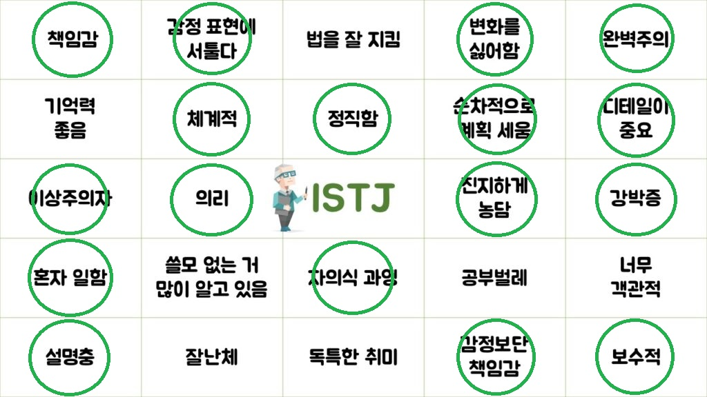

# 🌟소개합니다🌟

### 🧾 안녕하세요 제 이름은 박수미입니다

어렸을 때 게임을 접하면서 자연스럽게 개발에 대한 관심을 갖게 되었습니다.
하지만 개발을 배우기 위해 참여한 인공지능사관학교의 경험을 통해 현재는 `데이터 분석`에 많은 관심을 갖고 있습니다.

그렇다고 SSAFY를 소홀히 할 생각은 없습니다. SSAFY에서 기반을 단단하게 하고 제가 나아가고자 할 때 좋은 발판이 될 수 있도록 최선을 다할 생각입니다.

경제 전공이지만 회계를 혼자 꾸준히 공부했던 것처럼 제가 관심있는 분야🎯에는 매우 적극적으로 배우려고 하는 편입니다.

### 🌟 MBTI는 ISTJ입니다

낯을 많이 가리는 T지만 주변 사람들에게 따뜻함을 준다는 소리를 종종 듣습니다. 그리고 모든 일을 시작하기 전에 계획을 미리 세워두고 움직이는 편입니다.

### 🚀 취미는 게임과 주변 정리입니다

예전에는 게임을 즐겨했지만 최근에는 시간이 부족해지면서 방을 청소하거나 주변 물품들을 더 깔끔하게 정리할 수 있는 방법을 찾으며 소소한 즐거움을 느끼고 있습니다.

### 📈 함께 나아가는 것을 좋아합니다

배움의 높낮이가 다르더라도, 부족한 부분을 가르쳐주고 배우며 서로 놓쳤던 부분을 깨닫고 함께 성장해가는 것을 좋아합니다.

SSAFY에서 이런 경험들을 통해 많은 것을 배우기를 바라고 있습니다.

### 감사합니다

📞 010-8779-1121  
✉️ shocolatebox@gmail.com